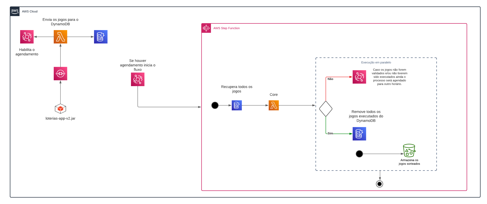

# loterias-app-v2
Versão 2 do app de simulações de jogos da Loteria (Mega-Sena, Lotofácil, Lotomania).

# IMPORTANTE - Configuração de ambiente
Para testar com o acompanhamento dos resultados por e-mail será necessário configurar as 
credenciais da AWS de sua conta (AWS_ACCESS_KEY_ID, AWS_SECRET_KEY) assim como a variável 
de Url da fila SQS (QUEUE_URL).

Execução: java -jar loterias-app-v2-jar-with-dependencies.jar

# Repositórios relacionados

* [Lambda validator](https://github.com/engjoaofaro/loterias-app-validator)
* [Lambda Core](https://github.com/engjoaofaro/loterias-app-core)
* [Lambda de captura de resultados](https://github.com/engjoaofaro/loterias-capture-results)

# Arquitetura

## License

[MIT](https://opensource.org/licenses/MIT)
